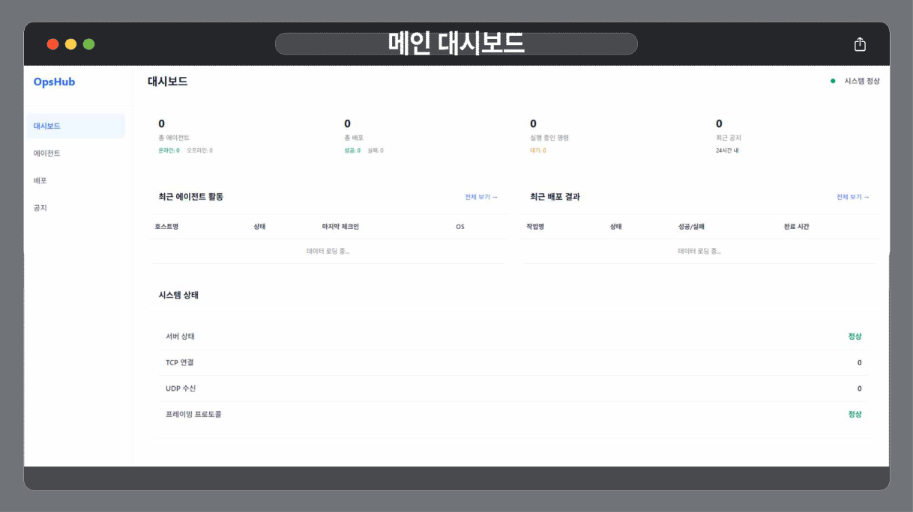

# ControlDock

[](#)
[](#)
[](#)
[](#)

여러 Windows PC를 중앙에서 관리하고, 상태 확인, 원격 배포, 공지 전송을 통합 처리하는 원격 운영 시스템입니다.



## What it demonstrates

- 관리자 승인 기반 PC 등록
- 에이전트 상태 확인과 하트비트 처리
- 원격 배포 요청 처리
- 공지 전송과 수신 확인
- 웹 대시보드 + 중앙 서버 + Windows 에이전트 구조

## 내가 한 것

- HTTP, TCP, UDP 서버 구조 설계와 구현
- PC 등록 승인 흐름 구현
- 에이전트 상태 확인과 하트비트 처리
- 원격 배포 요청 처리 로직 구현
- 공지 브로드캐스트 및 수신 추적 프로토콜 구현

## 스택

- Backend: Python, asyncio
- Agent: Python, PyQt6, pystray, pywin32
- Frontend: HTML, CSS, Vanilla JavaScript
- Data: Supabase
- Deploy: Docker, Docker Compose, PyInstaller

## 실행

운영 대상 PC의 인증·네트워크 설정과 Supabase 설정은 별도로 구성해야 합니다. 실제 운영 credential은 저장소에 넣지 않습니다.

### Server

```powershell
cd backend
pip install -r requirements.txt
python main.py
```

### Docker

```powershell
cd backend
docker-compose up --build
```

### Agent

```powershell
pip install -r app\requirements.txt
python app\main.py
```

## Scope

이 저장소는 중앙 서버·Windows agent·대시보드 간의 운영 흐름을 보여주는 개인 프로젝트입니다. 실제 원격 운영 환경에 적용하기 전에는 인증, 권한, 네트워크 노출 정책을 별도로 검토해야 합니다.
